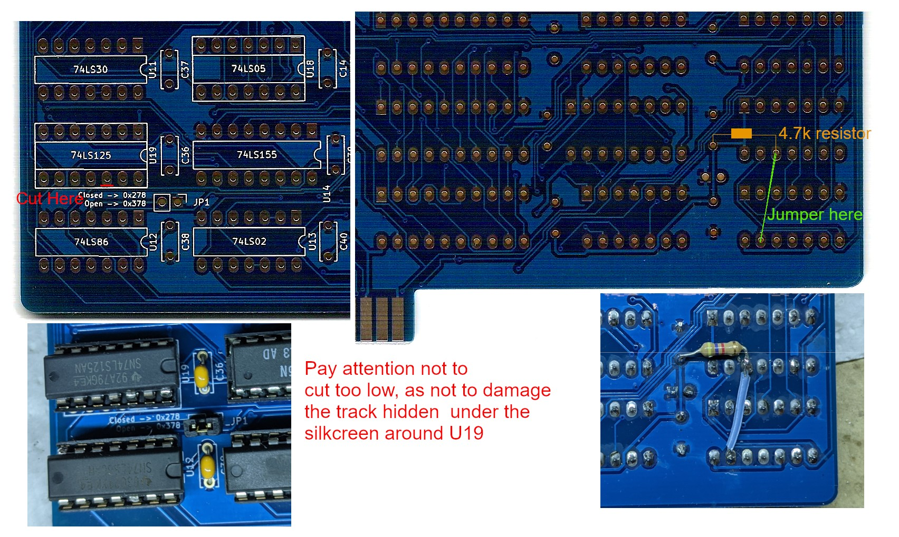

# Revision 1.0 Notes

## Parallel port header

The parallel port header is not standard in revision 1.0, and requires a custom cable to be made.
The pinout uses an odd-even scheme. A schematic looking at the male header on the front of the board:


```text
25 23 21 19 17 15 13 11 09 07 05 03 01
26 24 22 20 18 16 14 12 10 08 06 04 02
```

## Parallel port IRQ

Revision 1.0 board follows the IBM 5150 Technical Manual, but the parallel port presented there has a now out-of-standard IRQ triggering system. To bring it back in line with the now standard behavior, perform the following modification:

1. Cut the trace leading to pin 12 of U19. The best place to do this is right under the solder pad. Pay attention not to interrupt the trace hidden under the silkscreen
2. Bridge pin 12 of U19 with pin 13 of U12 with a piece of wire
3. Solder a pull-up resistor (4.7k ohm) between pin 12 of U19 and VCC (use the filter cap nearby).

Picture for reference.



