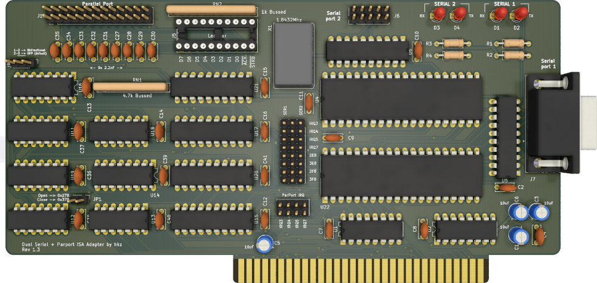

# Dual UART + Parallel port ISA adapter

## Introduction

This board adds a parallel port and two serial (RS232) ports to computers with a free ISA slot.

The schematics of this board is heavily inspired by the parallel port schematics found in the IBM 5150 Technical Reference, with just a few
changes (IRQ level triggering and configurable port directionality) and by Sergey's floppy/serial controller.

Both serial ports and the parallel port addressing/IRQs are configurable.

### Disclaimer

I take NO responsibility for what happens if you decide to build and use this card. Your computer might crash, catch fire or be destroyed in other nasty ways.
Also, as this card is mostly based on the work of others, You're encourauged to take what you seem fit from this, and use it in your projects!

## Configuration

### Parallel port

#### Addressing

- 0x278: Leave JP1 open
- 0x378: Close JP1

#### IRQ

Parallel port interrupt number can be selected by placing a single vertical jumper on the **ParPort IRQ** block.

For example, a jumper placed on the last column of that block, will set the IRQ for the parallel port to number 7.

#### Directionality

The parallel port can be configured as an old style 4bit, monodirectional, parallel port by jumpering pins 2-3 of JP2.
PS/2 style bidirectional port can be configured by jumpering pins 1-2.

### Serial ports

IRQ and addressing of serial ports can be configured by properly jumpering the 3x8 jumper block at the center of the board.

IRQ selection is performed by the first 4 rows of the block: placing an horizontal jumper between columns 1-2 will select IRQ for the first serial port, between columns 2-3 will select
the IRQ for the second serial port.

The same principle applies for the IO address, selected by the last 4 rows of the block: jumpers between column 1-2 will select an address for port 1, and between column 2-3 for port 2.

#### Example

To select IO at 0x3F8 and IRQ4 for port 1, connect a jumper on 2nd row, first two columns, and another jumper on 8th row, column 1-2

## Bill of Materials

All ICs are in DIP package.

- 4x 1k 1/4W resistors (**optional**)
- 4x 3mm LEDs (2x for UART RX indicators, 2x for TX) (**optional**)
- 1x 1.8432Mhz oscillator. DIP14 or DIP8
- 1x 8x4.7k bussed resistor array (9 pin)
- 1x 10x1.5k bussed resistor array (11 pin) (**optional**)
- 1x 10x LED bar, DIP20 (**optional**, socket this!)
- 8x 2.2nF / 25V ceramic capacitors, 5mm pitch
- 18x 100nF / 50v ceramic capacitors, 5mm pitch
- 4x 10uF / 50v electrolytic caps
- 2x 16C550 UARTs (16C450/16C650/16C750 should work, but are untested) in DIP40 format
- 2x 74HCT/LS138
- 2x 75C185
- 1x 74LS245
- 1x 74LS240
- 1x 74LS374
- 1x 74LS244
- 1x 74LS02
- 1x 74LS155
- 1x 74LS05
- 1x 74LS174
- 1x 74LS30
- 1x 74LS125
- 1x 74LS86
- 1x 2x13 pin header, 2.54mm
- 1x 2x4 pin header, 2.54mm
- 1x 2x8 pin header, 2.54mm
- 1x 1x8 pin header, 2.54mm
- 1x 1x2 pin header, 2.54mm
- 1x 1x3 pin header, 2.54mm
- 1x DB9 male, right angle, PCB mount (http://www.mouser.com/search/refine.aspx?Keyword=806-K22X-E9P-NJ15-99)
- 1x ISA card bracket - Keystone 9200-1 (http://www.mouser.com/ProductDetail/Keystone-Electronics/9200-1/?qs=sGAEpiMZZMsQtlBhqKq43VLJ3wppkop5) 

## Building notes

I **strongly advise AGAINST** soldering the LED bar for the parallel port: **socket it!** It is useful for debugging or to get some blinkenlights, but it loads the data pins, and some devices connected to the port might not like it. Socketing it will allow for a quick removal in case it becomes necessary.

RN2 depends on how bright you wish the LED bar to be, and how much load you want to put on the parallel port data pins. I usually fit an 1.5k resistor array.

## Credits

Thanks to [Sergey](http://www.malinov.com/Home/sergeys-projects) for all his projects!

